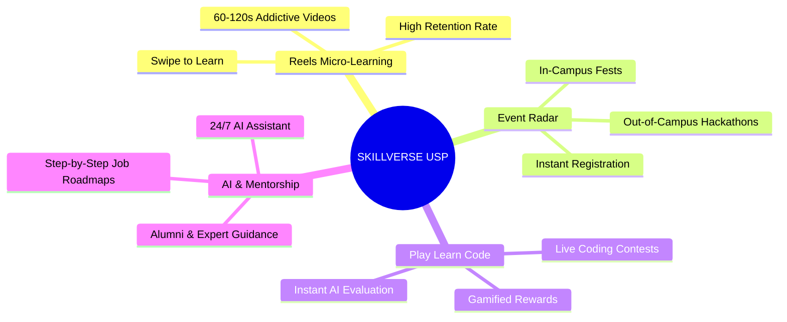
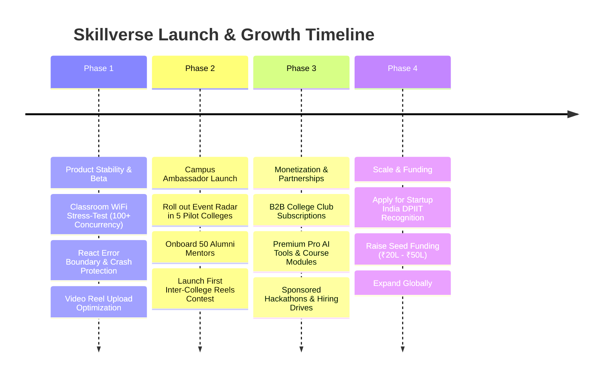

# 🚀 SKILLVERSE: The Next-Generation Play-Learn-Code & Creator Economy Ecosystem
**Investor Pitch Deck, Competitor Analysis & Strategic Roadmap**

---

## 🌟 1. EXECUTIVE SUMMARY & THE CORE PROBLEM

### 🛑 The Broken State of Modern Education
In today's fast-paced digital world, traditional EdTech and college ecosystems suffer from three critical failure points:
1. **The 40-Hour Video Fatigue:** Traditional online courses (Udemy, Coursera, recorded college lectures) force students to sit through 10, 20, or 40+ hours of monotonous, passive video content. **Result:** Over 90% of students abandon courses before completion due to sheer boredom and lack of engagement.
2. **Scattered Campus Event & Opportunity Radar:** Students constantly miss out on career-defining hackathons, technical workshops, cultural fests, and guest lectures happening both *in-campus* and *out-of-campus* because notices are lost in chaotic WhatsApp groups and dusty college noticeboards.
3. **The Isolation of Theory from Practice:** Coding platforms (LeetCode, HackerRank) are intimidating and divorced from structured mentorship, while social networks (LinkedIn, Discord) are filled with noise and spam rather than actionable learning roadmaps.

---

## 💡 2. THE SKILLVERSE REVOLUTION (OUR 5 CORE USPs)

Skillverse bridges the gap between entertainment, education, and career execution by transforming how Gen-Z students learn, code, and connect.

### 🎬 USP #1: Reels-Style Micro-Learning (EdTech meets TikTok/Reels)
* **The Innovation:** We condense complex engineering concepts, coding tutorials, and tech trends into **60-second to 120-second vertical video reels**.
* **Why it Wins:** Instead of mindlessly scrolling entertainment reels on Instagram/TikTok, students scroll through Skillverse educational reels. It turns daily scrolling habits into productive skill-building with near-100% completion rates!

### 🎪 USP #2: Universal Campus Event Hub & Ambassador Network
* **The Innovation:** Not just tech fests! Our dedicated **Campus Ambassadors** in every college post and organize ALL campus events: technical workshops, fun activities, cultural fests, industrial visits, campus tours, and webinars.
* **Why it Wins:** Organizers get instant reach to passionate students, and students get one-click registrations, reminders, and networking rooms. The #1 social & event radar for college life!

### 💻 USP #3: Integrated "Play + Learn + Code" Arena
* **The Innovation:** Learning is immediately tested. Students watch a concept reel or course module and instantly jump into live coding challenges with automated test cases and leaderboard ranking.
* **Why it Wins:** Eliminates the need to switch between YouTube for learning and LeetCode for practicing. Everything happens in one unified browser tab.

### 🤖 USP #4: AI Co-Pilot & 24/7 Academic Assistant
* **The Innovation:** Native AI tools integrated directly into the learning workflow—providing instant code bug explanations, homework assistance, resume optimization, and mock interview prep.

### 🤝 USP #5: Verified Alumni Mentorship & Step-by-Step Job Roadmaps
* **The Innovation:** Clear, visual roadmaps for high-demand careers (Full Stack, AI/ML, DevOps) coupled with direct 1-on-1 mentorship booking with college alumni and industry experts.

---

## 📊 3. PRESENT-WORLD COMPETITOR MATRIX & PROS/CONS

| Feature / Dimension | Traditional EdTech *(Udemy, Coursera, PW)* | Pure Coding Platforms *(LeetCode, HackerRank)* | Social & Career Nets *(LinkedIn, Discord)* | **🚀 SKILLVERSE** *(The All-in-One Ecosystem)* |
| :--- | :--- | :--- | :--- | :--- |
| **Content Format** | 10 to 40+ Hour Long Videos | Text Problems & Editor | Text Posts & Images | **60-120s Vertical Reels + Interactive Courses** |
| **Student Engagement** | Very Low (< 10% finish rate) | Medium (Only hard-coders) | High (But high spam/noise) | **Ultra-High (Addictive swipe-to-learn UI)** |
| **Campus Event Radar** | ❌ None | ❌ None | ⚠️ Scattered & Unverified | **✅ Tech, Non-Tech, Fun, Tours & Webinars Hub** |
| **Integrated Coding Arena**| ❌ None (Passive viewing) | ✅ Excellent | ❌ None | **✅ Live Coding Contests + AI Code Evaluator** |
| **Mentorship & Alumni** | ❌ None | ❌ None | ⚠️ Cold DMing (Low response)| **✅ Verified Alumni & Expert Booking System** |
| **AI Assistant Integration**| ⚠️ Limited / Paid add-on | ⚠️ Premium only | ❌ None | **✅ Native 24/7 AI Tools & Code Debugger** |
| **Target Audience** | Passive learners | Competitive programmers | Job seekers & professionals | **Gen-Z Students, Ambassadors, Coders & Colleges** |

### 🔍 Detailed Competitor Breakdown

#### 1. Traditional EdTech (Udemy, Coursera, PhysicsWallah, Unacademy)
* **Pros:** Deep, comprehensive curriculum; established brand recognition; university certifications.
* **Cons:** Extremely boring and passive; zero real-time coding practice; disconnected from college campus life and live student events; outdated 40-hour video model.
* **How Skillverse Wins:** By breaking down multi-hour courses into bite-sized, gamified **Reels**, Skillverse matches the attention span of modern students while integrating practical coding and live community events.

#### 2. Pure Coding Platforms (LeetCode, HackerRank, CodeChef)
* **Pros:** Industry-standard coding problems; excellent preparation for technical coding interviews.
* **Cons:** Intimidating for beginners; zero theoretical teaching or video explanations; no community event tracking; lacks holistic career guidance and mentorship.
* **How Skillverse Wins:** Skillverse combines the *fun of video learning* with the *rigor of coding practice*. A student learns algorithm logic via a 60-second Reel and immediately writes code to solve it.

#### 3. Social & Career Networks (LinkedIn, Discord, WhatsApp Groups)
* **Pros:** Networking opportunities; instant messaging; community formation.
* **Cons:** Unstructured; heavy spam and noise; noticeboards get lost in chat history; no verified learning path or built-in coding environment.
* **How Skillverse Wins:** Skillverse organizes community interaction into structured **Campus Clubs, Live Rooms, and Event Detail Pages** without the noise of general social media.

---

## 🎬 4. AI VIDEO TEASERS & EXPLAINER SCRIPTS
*Ready-to-use storyboards and prompts for AI Video Generators (InVideo AI, Luma Dream Machine, HeyGen, Runway Gen-3).*

> [!TIP]
> **⚡ 10-SECOND VIRAL TEASER CLIP (For Instagram Reels & YouTube Shorts)**
> * **Duration:** 00:10s
> * **Visual Action:** A dynamic, fast-paced montage starting with a student bored by a 40-hour video, instantly transitioning to a lively campus lawn where a **Skillverse Campus Ambassador** is holding up a smartphone. Floating neon holographic bubbles pop out of the phone showing: *"⚡ 60s Learning Reels", "🎉 College Fests & Fun Activities", "🏭 Industrial & Campus Tours", "💡 Technical Workshops", and "🚀 Live Coding Arena"*.
> * **Audio Voiceover / Trending Beat:** *"Why just study when you can live the complete campus life? 60-second learning Reels, College Fests, Industrial Tours, Fun Activities, and Live Coding — All in one app! This is SKILLVERSE. Join the revolution!"*

### 📹 Full 60-Second Investor & Campus Explainer Script

* **Target Duration:** 60 Seconds
* **Tone:** Energetic, Modern, Inspiring, Fast-Paced
* **Background Music:** Upbeat electronic / synth-wave instrumental

| Time | Visual / AI Video Scene | Voiceover / Audio Script | On-Screen Text / Captions |
| :--- | :--- | :--- | :--- |
| **0:00 - 0:10** | A tired college student sitting in front of a laptop at midnight, staring at a "Course Progress: 4% (38 Hours Remaining)" bar. He yawns and rubs his eyes. | *"Let’s be honest. Nobody wants to sit through 40 hours of boring video lectures anymore. And while you’re buried in outdated videos..."* | **40-Hour Courses? NOBODY HAS TIME.** |
| **0:10 - 0:20** | Split screen: Left side shows chaotic WhatsApp groups flooded with spam. Right side shows a student missing a major campus hackathon trophy. | *"...you're also missing out on massive campus hackathons, tech fests, and mentorship opportunities lost in chaotic WhatsApp groups!"* | **Missing Out on Campus Events & Hackathons?** |
| **0:20 - 0:33** | Fast, dynamic zoom-in into the **Skillverse Logo**. Transition to a smartphone screen smoothly scrolling through vibrant, educational vertical Reels. | *"Enter **Skillverse** — the revolutionary Play, Learn, and Code ecosystem built for Gen-Z! We turned education into addictive 60-second Reels!"* | **Welcome to SKILLVERSE! 🚀 Swipe. Learn. Grow.** |
| **0:33 - 0:45** | Screen splits: One side shows a student watching a quick Reel on Python/AI, then tapping a button to instantly code and solve a live problem with AI assistance. | *"Watch a concept reel, jump straight into live coding contests, and use our 24/7 AI Co-Pilot to debug your code instantly!"* | **Reels + Live Coding + AI Co-Pilot 💻** |
| **0:45 - 0:53** | A vibrant map/radar showing "In-Campus Fests" and "Out-of-Campus Hackathons". A student clicks "Apply Mentor" and connects with a top college alumnus. | *"Never miss an event again with our Campus Event Radar, and connect directly with verified alumni and mentors for step-by-step job roadmaps!"* | **Event Radar & Alumni Mentorship 🤝** |
| **0:53 - 1:00** | Group of happy students celebrating with trophies and certificates on a campus lawn. Skillverse logo and QR code appear on screen. | *"Why just study when you can Play, Learn, and Conquer? Join the Skillverse revolution today!"* | **SKILLVERSE: The Future of Learning. 🌐 Join the Revolution!** |

---

## 📈 5. STARTUP EXECUTION & GO-TO-MARKET (GTM) ROADMAP

### 🎯 Immediate Next Steps for the Founders:
1. **Classroom Stress-Test:** Deploy the latest high-concurrency commit (`375d468`) and share the link with 100+ students in class to validate server resilience.
2. **AI Video Creation:** Feed Section 4 script into an AI video tool (InVideo AI or HeyGen) to generate our 60-second teaser trailer.
3. **College Noticeboard Integration:** Reach out to College Club presidents to post their upcoming events on Skillverse's Event Radar!

---
*Document Prepared by Skillverse Engineering & Strategy Team · Confidential · All Rights Reserved.*
